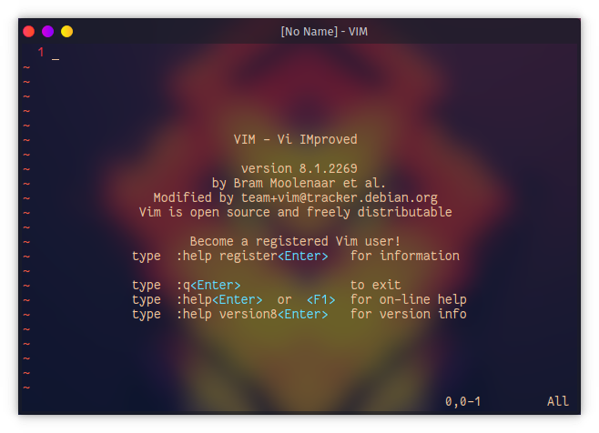

**Linux File Hierarchy Structure**
---
In the FHS, all files and directories appear under the root directory /, even if they are stored on different physical or virtual devices.


---

## 1. The Root Directory   **/ (Root)**

---
- Everything on your Linux system is located under the / directory, known as the root directory. 
- You can think of the / directory as being similar to the C:\ directory on Windows – but this isn’t strictly true, as Linux doesn’t have drive letters. 
- While another partition would be located at D:\ on Windows, this other partition would appear in another folder under / on Linux.


---
---
## 2.The /bin directory  **/bin**
---
- The /bin directory contains the essential user binaries (programs) that must be present when the system is mounted in single-user mode.
- Applications such as Firefox are stored in /usr/bin, while important system programs and utilities such as the bash shell are located in /bin. 
- The /usr directory may be stored on another partition – placing these files in the /bin directory ensures the system will have these important utilities even if no other file systems are mounted. 
- The /sbin directory is similar – it contains essential system administration binaries.

  -  **e.g) cat, ls, cp,pwd**


---

## 3) /boot - Boot loader files
---
- The /boot directory contains the files needed to boot the system – for example, the GRUB boot loader’s files and your Linux kernels are stored here. 
- The boot loader’s configuration files aren’t located here, though – they’re in /etc with the other configuration files.


---
## **4. /dev - Essential Device files**

---
- Linux exposes devices as files, and the /dev directory contains a number of special files that represent devices. 
- These are not actual files as we know them, but they appear as files – for example, /dev/sda represents the first SATA drive in the system. 
- If you wanted to partition it, you could start a partition editor and tell it to edit /dev/sda.


---
## **5. /etc System configuration files.**
---
- Contains configuration files 
required by all programs.
- This also contains startup and 
shutdown shell scripts used to 
start/stop individual programs.
  -  Example: /etc/resolv.conf, 
/etc/logrotate.conf


---
## **6) /home - Home directory**
---
- The /home directory contains a home folder for each user. For example, if your user name is bob, you have a home folder located at /home/bob. 
- This home folder contains the user’s data files and user-specific configuration files. Each user only has write access to their own home folder and must obtain elevated permissions (become the root user) to modify other files on the system.
---
## **7.  /lib – Essential Shared Libraries**
---
- The /lib directory contains libraries needed by the essential binaries in the /bin and /sbin folder. 
- Libraries needed by the binaries in the /usr/bin folder are located in /usr/lib.
---
## **8. /media – Removable Media**
---
- The /media directory contains subdirectories where removable media devices inserted into the computer are mounted. 
- For example, when you insert a CD into your Linux system, a directory will automatically be created inside the /media directory. 
- You can access the contents of the CD inside this directory.
---
## **9. /mnt – Temporary Mount Points**
---
- The /mnt directory is where system administrators mounted temporary file systems while using them. 
- For example, if you’re mounting a Windows partition to perform some file recovery operations, you might mount it at /mnt/windows.
 - However, you can mount other file systems anywhere on the system.
---
## **10. /opt – Optional Packages**
---
- The /opt directory contains subdirectories for optional software packages. 
- It’s commonly used by proprietary software that doesn’t obey the standard file system hierarchy – for example, a proprietary program might dump its files in /opt/application when you install it.
---

### **11. /sbin – System Administration Binaries**
---
- The /sbin directory is similar to the /bin directory. 
- It contains essential binaries that are generally intended to be run by the root user for system administration.
---
## **12. /tmp – Temporary Files**
---
- Applications store temporary files in the /tmp directory. 
- These files are generally deleted whenever your system is restarted and may be deleted at any time by utilities such as tmpwatch.
- Files under this directory are 
**deleted** when system is 
rebooted.
---
## **13. /usr –User Binaries & Read-Only Data**
---
- The /usr directory contains applications and files used by users, as opposed to applications and files used by the system. 
- For example, **non-essential** applications are located inside the **/usr/bin directory** instead of the **/bin directory** and **non-essential system administration binaries** are located in the **/usr/sbin directory** instead of the /sbin directory. 
- Libraries for each are located inside the /usr/lib directory. The /usr directory also contains other directories – for example, architecture-independent files like graphics are located in /usr/share.

- The /usr/local directory is where locally compiled applications install to by default – this prevents them from mucking up the rest of the system.


---
## **Text Editors for linux**
---
- Programs That user for text processing.

- Linux command line text editors

  -  VIM
  -  Nano
  - Emacs
  - Neovim
  - etc **...**

- Linux Graphical Text editors
  - Sublime
  - ○ Vscode
  - ○ Gedit
  - ○ Pluma
  - etc **...**
---
 # **Vim editor**
   
- is an advanced and highly configurable text editor built to enable efficient text editing. 
- it is developed by Bram Moolenaar. It supports most file types and vim editor is also known as a programmer’s editor. We can use its plugin based on our needs

- To install vim on Debian based Linux like ubuntu run the command:
  ``` 
  sudo apt-get install vim
  ``` 
- To install vim on an arch-based distro run the following command:
  ``` 
  sudo pacman -S vim
  ``` 
- You can open vim by running vim command on the terminal.
  ``` 
  vim
  ``` 


Now, Let’s Start to use Vim
1. **To open a file in vim editor**

     ``` 
        vim filename.txt
    ``` 
2. **Write into file**
   - type i
    ``` 
     i
     ``` 
        After going into insert mode you will see **INSERT** in the status bar. After that, we can write any data in it.

3. **To Save and Exit:**
   - We have written the data into a file now the task is to save and close the file to do that first exit from insert mode by **pressing the Esc key.**
   - To write a command first **type semicolon  (  :  )** and then type the command wq!  or x! (both do the same thing) And then hit ENTER.
     ``` 
      :wq!
      ``` 
4. **Exit without saving the file:**

   -  To exit from the file without saving the file just use the command q! As follows
    
      ``` 
      :q!
      ``` 

5. **Exiting Vim:**

   - To exit without doing anything go into command mode by pressing the Esc key and type the following command.
     ``` 
      :q

     ``` 
Vim also comes with its own tutorial. You can see this tutorial by command vimtutor into the terminal .
  ``` 
      vimtutor

  ``` 
  [reference](https://www.geeksforgeeks.org/getting-started-with-vim-editor-in-linux/)

---  

 # **NANO  editor**

 - GNU nano is a friendly and convenient text editor like vi and emac. It offers many other extra features like word searching, replacing, jump to a line or column, filename tab completion, auto-indentation, etc.

- Nano is a clone of the pico text editor. Nano is not pre-installed in all distros, but Ubuntu has it.
  ``` 
      nano

  ``` 
 ---
## **Linux User Management**
  ---
  - On Computer system, person who uses the
  - Computer is called **“user”**
  Every Users have Group.
  - Users have their own file & applications.

  - To know our name on linux -> **“ whoami “**
  - Those users have power/privilege.
  - On linux their is 2 kinds users.
    - Root id = 0
    - Normal User id= 1-99

  **The root user have the power to do everything on linux ,**

  but if users want to have **a root access** they add **sudo** in front of the command .

  ---
  ## **Creating Users**
  ---
  - On linux, to create users you can use the following commands
  1. **Useradd command**
     ``` 
      sudo useradd test
   1. **Useradd command**

      ``` 
      sudo useradd test1
  
       ``` 
    
- The User **files** are stored inside **/etc/passwd**

- The User **password** are stored inside **/etc/shadow**
---
## **To access root user**

  ``` 
      sudo su 
  
 ``` 
 ------------

 [user management reference](https://www.researchgate.net/publication/352134746_Linux_User_and_Group_management)


